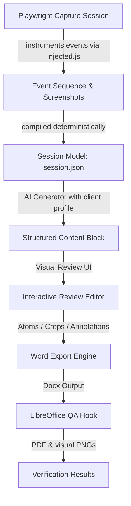

# DocBot v3 — Architecture

DocBot v3 is a state-of-the-art documentation automation pipeline that captures user browser interactions, processes them using structured LLM generators, and exports them into pixel-faithful corporate Word manuals.

---

## 1. System Overview



---

## 2. Directory Layout & Module Structure

```
doc_automation_v2/
  config.yaml               # System settings, active provider
  main.py                   # Central pipeline orchestration CLI
  assemble.py               # Lightweight module compilation script
  master_assembler.py       # Full-manual multi-module compiler
  
  docbot/
    clients/
      profile.py            # Unified yaml client config loader (with _default fallback)
    export/
      word_fields.py        # Native Word SEQ field XML generators
      qa.py                 # LibreOffice headless converter & page rasteriser
    processing/
      generator.py          # Vision/Text LLM caller with content-hash cache & id-merge
      regions.py            # Heuristic region extractor with IoU merge
      steps.py              # Non-LLM deterministic event compiler
      crops.py              # Click element PIL crop extractor
      annotate.py           # Custom PIL annotator (W27 overlap prevention)
    recorder/
      capture.py            # Heading Playwright page event listener (DPIScale=1, W7/W8/W9)
      injected.js           # Client-side DOM event hooks (debounced input, sensitive redaction)
    models.py               # Pydantic v2 session data model & atomic SessionStore
    
  ui/
    launcher.py             # Main system dashboard launcher
    review.py               # Master visual review canvas editor
    style_editor.py         # 8-tab visual formatting editor
```

---

## 3. Core Architectural Concepts

### Principle 1: Record actions, not screenshots (Ground Truth)
`docbot/recorder/injected.js` listens to raw DOM events (`click`, `input`, `change`, `submit`, `navigate`, `keypress_enter`) and captures their bounding boxes. `docbot/processing/steps.py` deterministically compiles this raw stream into logical procedural action steps. 

### Principle 2: Vision-first Single-Call AI
Instead of multi-step chains, `docbot/processing/generator.py` calls the LLM once per screen, sending the screenshot alongside serialized elements, events, and regions. The LLM returns a single fully-populated JSON schema (`ScreenDocResponse`) containing screen name, purpose, steps, and notes.

### Principle 3: Merge-by-ID Schema Grounding
Fields and regions are merged back into the session model using unique stable string IDs (`r1`, `el_0` etc.). This prevents index-shifting merging bugs where modifications in one step corrupt neighboring rows.

### Principle 4: Atomic Session Store
All state is read from and written to `sessions/<session_id>/session.json`. `SessionStore` performs atomic writes by writing to a temporary file in the same directory and renaming it, preventing data corruption.

### Principle 5: Native Word SEQ captioning
Figure and Table captions are written using Word's native XML field structures:
`<w:instrText> SEQ Figure \* ARABIC </w:instrText>`
This enables users to regenerate a complete Table of Figures/Tables directly inside Word using `Update Field` (F9).
